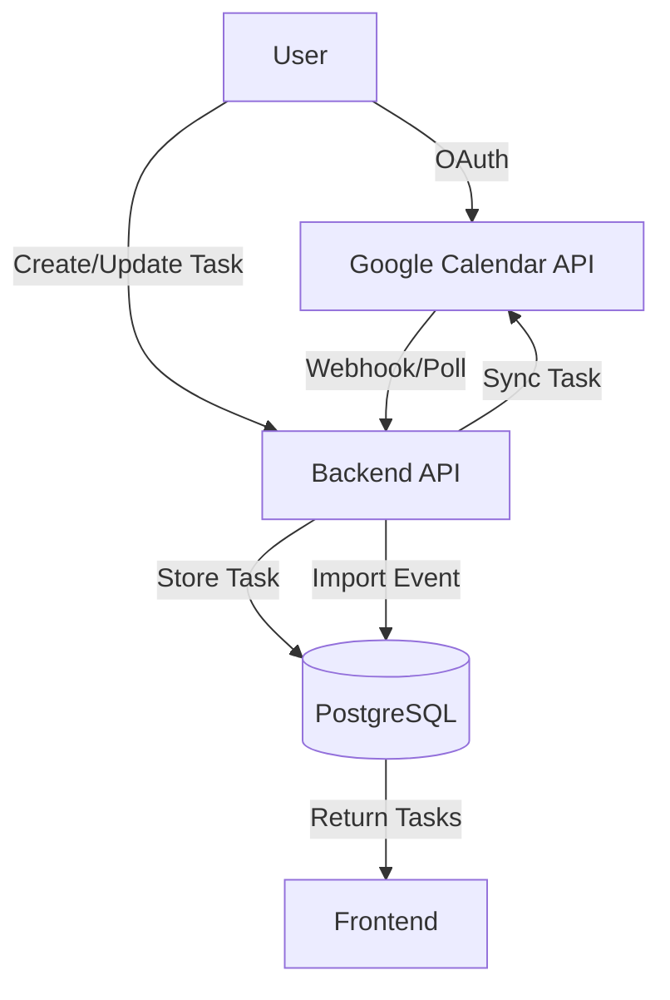

#Google Calendar Two-Way Automatic Sync

## Overview

Implement bidirectional automatic synchronization between ADD Daily tasks and Google Calendar. Tasks with `scheduled_date` and `scheduled_time` will sync to Google Calendar events, and Google Calendar events will import as tasks.

## Architecture

## Database Changes

### 1. Add `google_calendar_event_id` to tasks table

- Track which Google Calendar event corresponds to each task
- Allows updating/deleting the correct event when task changes
- Location: `backend/schema.sql`

### 2. Create `google_calendar_tokens` table

- Store OAuth tokens per user for Google Calendar API access
- Fields: `user_id`, `access_token`, `refresh_token`, `expires_at`, `calendar_id`
- Location: `backend/schema.sql`

## Backend Implementation

### 1. Google Calendar OAuth Flow (`backend/server.py`)

- Enable `/auth/google/callback` endpoint to handle OAuth callback
- Store tokens in `google_calendar_tokens` table
- Implement token refresh logic (tokens expire after 1 hour)
- Update `/auth/google/status` to check if user has valid tokens

### 2. Google Calendar API Client (`backend/calendar/google_calendar.py` - new file)

- Create wrapper for Google Calendar API using `google-api-python-client`
- Functions:
- `create_event()` - Create calendar event from task
- `update_event()` - Update existing calendar event
- `delete_event()` - Delete calendar event
- `list_events()` - Fetch events from calendar
- `refresh_token()` - Refresh expired access token

### 3. Task → Calendar Sync (`backend/server.py`)

- Modify `push_to_calendar` to also create Google Calendar events
- Add sync on task create/update/delete for scheduled tasks
- Store `google_calendar_event_id` in tasks table when event is created

### 4. Calendar → Task Sync (`backend/server.py`)

- New endpoint: `POST /api/calendar/sync-from-google`
- Fetch events from Google Calendar
- Create/update tasks from calendar events
- Handle conflicts (if both task and event were modified)

### 5. Automatic Sync Triggers

- **Option A: Webhooks** (preferred but requires public URL)
- Set up Google Calendar push notifications
- Requires webhook endpoint: `POST /api/calendar/webhook`
- **Option B: Polling** (fallback)
- Background task that polls Google Calendar every 5-10 minutes
- Check for new/updated events and sync to tasks

### 6. Conflict Resolution

- Track `last_synced_at` timestamp on tasks
- If task modified after last sync → task wins (update calendar)
- If calendar event modified after last sync → calendar wins (update task)
- If both modified → use most recent timestamp

## Frontend Implementation

### 1. Google Calendar Connection UI (`frontend/src/components/MainApp.jsx`)

- Add "Connect Google Calendar" button in settings
- Show connection status (connected/disconnected)
- Add "Disconnect" option

### 2. Sync Status Indicator

- Show sync status (syncing, last synced, error)
- Display sync errors if any

## Dependencies

### Backend (`backend/requirements.txt`)

- Add `google-api-python-client>=2.0.0`
- Add `google-auth-httplib2>=0.2.0`
- Add `google-auth-oauthlib>=1.2.0`

## Environment Variables

### Backend (`backend/.env.example`)

- `GOOGLE_CLIENT_ID` - Already exists
- `GOOGLE_CLIENT_SECRET` - Already exists
- `GOOGLE_CALENDAR_REDIRECT_URI` - OAuth redirect URI (e.g., `https://your-domain.com/api/auth/google/calendar/callback`)

## Implementation Steps

1. **Database Schema Updates**

- Add `google_calendar_event_id` column to `tasks` table
- Create `google_calendar_tokens` table
- Add migration SQL script

2. **Google Calendar API Client**

- Create `backend/calendar/google_calendar.py`
- Implement OAuth token management
- Implement CRUD operations for calendar events

3. **OAuth Flow**

- Enable and fix `/auth/google/callback` endpoint
- Store tokens securely in database
- Implement token refresh

4. **Task → Calendar Sync**

- Hook into task create/update/delete endpoints
- Sync scheduled tasks to Google Calendar
- Store event IDs for future updates

5. **Calendar → Task Sync**

- Implement polling or webhook endpoint
- Import calendar events as tasks
- Handle duplicates and conflicts

6. **Frontend UI**

- Add Google Calendar connection UI
- Show sync status
- Handle errors gracefully